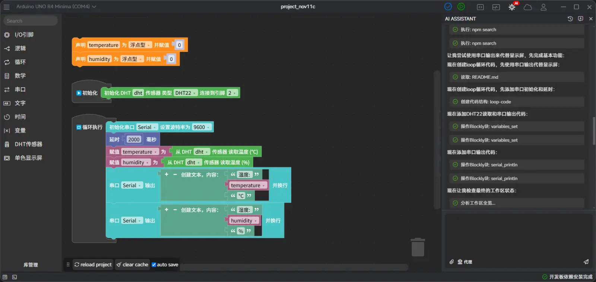

# aily blockly

[English](README.md) | 中文

## 项目概述
`aily-blockly` 当前正在被重构为一个 Tesseract-first 的桌面硬件工作流工作台。

这次 MVP 保留原有 Electron + Angular 外壳、legacy Blockly 编辑器、开发板工具链、串口监视器和项目管理能力，同时新增：

- 由 Electron 托管的本地 Tesseract Agent sidecar
- 由 Electron 托管的本地 n8n 运行时
- 作为默认项目体验的 Tesseract Studio 工作区
- 面向现有 `.abi` 项目的 legacy Blockly 回退路径

这个仓库仍然是 `aily-blockly` 主体代码库，但当前集成方向已经切换为“硬件版 Cursor”：自然语言 -> 工作流蓝图 -> 本地 n8n 工作流 -> 硬件配置引导。



> 当前状态：Tesseract MVP。桌面端已经用于开发和集成验证，但并不定位为量产级固件 IDE。

## 产品方向
桌面端现在区分两种项目模式：

1. `Tesseract 项目`
   - 由 `.tesseract/manifest.json` 标识
   - 工作流快照保存在 `.tesseract/workflow.json`
   - 打开后进入 `/main/tesseract-studio`
2. `Legacy Blockly 项目`
   - 由 `project.abi` 标识
   - 打开后进入 `/main/blockly-editor`

如果两者都不存在，则回退到代码编辑器。

## 运行拓扑
- Electron 主进程继续保持 JavaScript 结构，不单独引入新的 TS 主进程构建链。
- Electron 通过进程托管方式拉起本地 Tesseract Agent，而不是把 backend TypeScript 直接嵌进主进程。
- Electron 通过本地 n8n 进程提供工作流编辑和部署能力。
- Angular 前端通过 preload 暴露的桌面 API 与这两个运行时交互。
- 现有云端 `ask/agent` 模式继续保留；Tesseract 项目默认切到本地 `tesseract` 模式。

## 当前主能力
- Tesseract Studio 作为默认工作区
- 通过嵌入式 n8n 提供本地工作流编辑
- 使用 `aily-*` markdown viewer 渲染 Tesseract Agent 输出
- 保留 legacy Blockly、pinmap、连线图能力作为回退路径
- 继续复用现有硬件生态：开发板包、npm 库管理、串口监视器、编译和烧录流程

## 开发命令
在当前目录执行：

```bash
npm install
npm start
npm run electron
npm run build
```

Tesseract 桌面运行时依赖兄弟目录 `../backend` 存在且可构建。Electron 构建流程会显式校验该依赖，而不是静默降级。

## 目录说明
- `src/app/editors/tesseract-studio/`: 新的 Tesseract-first 工作区
- `src/app/tools/aily-chat/`: 对话 UI、markdown viewer、本地/远端模式切换
- `src/app/components/float-sider/`: 按路由切换的工作区侧栏
- `electron/`: 主进程 IPC、runtime manager、preload bridge
- `docs/design-docs/tesseract-integration-context.md`: 由 PRD 与对话记录压缩整理出的集成上下文

## 文档
- [设计文档导航](./docs/DESIGN.md)
- [Tesseract 集成上下文](./docs/design-docs/tesseract-integration-context.md)
- [前端开发文档](./docs/FRONTEND.md)
- [计划导航](./docs/PLANS.md)
- [使用文档](https://aily.pro/doc)
- [库适配文档](https://github.com/ailyProject/aily-blockly-libraries/blob/main/%E5%BA%93%E8%A7%84%E8%8C%83.md)

## 相关仓库
- [开发板](https://github.com/ailyProject/aily-blockly-boards)
- [block 库](https://github.com/ailyProject/aily-blockly-libraries)
- [编译器](https://github.com/ailyProject/aily-blockly-compilers)
- [相关工具](https://github.com/ailyProject/aily-project-tools)

## 项目赞助
本项目由以下企业和个人赞助。

### 企业赞助
<a target="_blank" href="https://www.seeedstudio.com/" >
    
</a><br>
<a target="_blank" href="https://www.seekfree.cn/" >
    
</a><br>
<a target="_blank" href="https://www.diandeng.tech/" >
    
</a><br>
<a target="_blank" href="https://www.openjumper.com/" >
    
</a><br>
<a target="_blank" href="https://www.pdmicro.cn/" >
    
</a><br>
<a target="_blank" href="https://www.titlab.cn/" >
    
</a><br>
<a target="_blank" href="https://www.emakefun.com" >
    
</a><br>
<a target="_blank" href="http://www.keyes-robot.com/" >
    
</a>

### 个人赞助
陶冬(天微电子)
夏青(蘑菇云创客空间)
杜忠忠Dzz(社区伙伴)
李端(益学汇)
孙俊杰(社区伙伴)

## 本项目使用到的主要开源项目
- [electron](https://www.electronjs.org/)
- [angular](https://angular.dev/)
- [node](https://nodejs.org/)
- [n8n](https://n8n.io/)

其他依赖见 [package.json](./package.json)。

## AI 参考项目
- [Kode](https://github.com/shareAI-lab/Kode-cli)
- [copilot](https://github.com/microsoft/vscode-copilot-chat)

## 附加权利说明
1. 本软件为 GPL 协议下的免费软件，在无授权的情况下，不得销售本软件及基于本软件的衍生软件；
2. 使用本软件开发的硬件作品不受 GPL 限制，用户可自行决定发布和使用方式；
3. 基于本软件的衍生品，不得移除本项目相关权利人、赞助者信息，且必须保证相关信息出现在软件启动页；
4. 不得移除本项目附带的线上服务内容。
