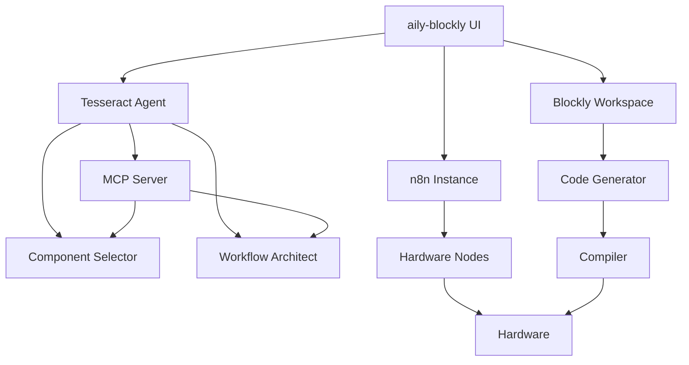

# Tesseract 反向整合执行计划

**文档版本:** v1.0
**创建日期:** 2026-03-03
**目标:** 将 Tesseract 的 n8n Agent 能力整合到 aily-blockly 项目中

---

## 执行概要

本文档指导将 Tesseract backend 的核心 Agent 能力（自然语言 → n8n 工作流）整合到 aily-blockly 桌面应用中，同时复用 aily-blockly 已有的硬件组件生态系统。

### 核心目标

1. **保留 aily-blockly 的完整硬件生态**：17+ 开发板、完整工具链、Blockly 编程
2. **注入 Tesseract 的 Agent 能力**：自然语言 → n8n 工作流 → 硬件配置
3. **统一用户体验**：Blockly 编程 + n8n 工作流 + AI Agent 三位一体

---

## 项目架构对比分析

### aily-blockly 现有架构

```
用户需求 (Angular UI)
    ↓
Aily Chat (MCP 客户端)
    ↓
AI Tools (Blockly 编辑、文件操作、项目管理)
    ↓
Blockly Workspace (可视化编程)
    ↓
Code Generator (C/C++ 代码生成)
    ↓
Compiler (Arduino CLI / PlatformIO)
    ↓
Uploader (串口烧录)
    ↓
Hardware (17+ 开发板)
```

**核心优势：**
- 完整的硬件开发工具链
- 丰富的开发板支持（Arduino、ESP32、XIAO 系列等）
- 成熟的 Blockly 可视化编程
- Electron 桌面应用，无需服务器

### Tesseract backend 架构

```
用户需求 (自然语言)
    ↓
IntakeAgent (意图解析)
    ↓
ComponentSelector (组件选择)
    ↓
WorkflowArchitect (n8n 工作流生成)
    ↓
MCP Validator (校验与自动修复)
    ↓
n8n API (部署工作流)
    ↓
ConfigAgent (引导配置)
    ↓
Hardware (通过工作流控制)
```

**核心优势：**
- 自然语言理解与意图解析
- n8n 工作流作为中间表示
- 智能组件选择与推荐
- 自动校验与修复机制

### 整合后的目标架构

```
用户需求 (Angular UI)
    ↓
    ├─ Blockly 编程路径 (保留)
    │   ↓
    │   Blockly Workspace → Code Generator → Compiler → Hardware
    │
    └─ AI Agent 路径 (新增)
        ↓
        Tesseract Agent (嵌入式)
            ↓
            ├─ 路径 A: 生成 Blockly 块 → Blockly Workspace → 编译烧录
            │
            └─ 路径 B: 生成 n8n 工作流 → n8n 实例 → 硬件配置
```

**整合优势：**
- 保留 Blockly 编程的灵活性
- 增加自然语言交互能力
- 支持两种硬件配置方式（编译烧录 + 工作流配置）
- 复用 aily-blockly 的硬件生态

---

## aily-blockly 可复用硬件组件清单

### 🔥 高价值硬件生态（直接复用）

#### 1. 开发板配置系统
**源文件：** `electron/config/boards.json`

**包含开发板：**
- **Arduino 系列：** UNO R3, MEGA, Nano, UNO R4 (Minima/WiFi)
- **ESP32 系列：** ESP32, ESP32-C3, ESP32-S3, Wifiduino 系列
- **XIAO 系列：** ESP32C3, ESP32S3, RA4M1
- **教育板：** Grove Beginner Kit, 掌控板 2.0, 金牛创翼板
- **特殊板：** AI-VOX, Seekfree Robot, Unitree G1

**复用价值：**
- 17+ 开发板的完整配置（引脚图、规格、编译参数）
- 品牌分类与版本管理
- 图片资源（board.webp, pinmap.webp）

**整合方案：**
- 将开发板配置映射到 Tesseract 硬件组件库
- 每个开发板对应一组 n8n 节点（GPIO、传感器、通信）
- 保留 Blockly 编程能力作为备选方案

**目标位置：** `backend/src/config/hardware-boards.json`

---

#### 2. 编译工具链
**源文件：** `child/compile.js`, `child/upload.js`

**支持工具：**
- Arduino CLI
- PlatformIO
- 跨平台编译（Windows/macOS/Linux）

**复用价值：**
- 成熟的编译流程
- 错误处理与日志
- 多平台兼容性

**整合方案：**
- 保留编译工具链用于 Blockly 路径
- 为 n8n 工作流路径提供固件生成能力
- 支持混合模式（工作流 + 自定义代码）

**目标位置：** `backend/src/services/compiler-service.ts`

---

#### 3. 串口通信系统
**源文件：** `src/app/tools/serial-monitor/`

**功能：**
- 串口扫描与连接
- 数据收发（文本/十六进制）
- 数据可视化（图表、历史记录）
- 快速发送预设

**复用价值：**
- 完整的硬件调试工具
- 数据可视化组件
- 历史记录管理

**整合方案：**
- 保留串口监视器作为调试工具
- 集成到 n8n 工作流调试流程
- 支持工作流节点的实时监控

**目标位置：** 保留在 aily-blockly，通过 IPC 与 Agent 通信

---

#### 4. Blockly 库管理系统
**源文件：** `src/app/services/library.service.ts`

**功能：**
- npm 包管理（安装、卸载、更新）
- 库版本控制
- 依赖解析

**复用价值：**
- 工程化项目管理
- 库生态系统
- 版本兼容性处理

**整合方案：**
- 将 Blockly 库映射到 n8n 节点库
- 支持自定义节点的 npm 安装
- 统一依赖管理

**目标位置：** `backend/src/services/library-manager.ts`

---

#### 5. 项目配置系统
**源文件：** `src/app/services/project.service.ts`

**功能：**
- 项目元数据管理
- 开发板选择
- 编译配置
- 文件结构管理

**复用价值：**
- 成熟的项目管理模式
- 配置持久化
- 多项目支持

**整合方案：**
- 扩展项目配置支持 n8n 工作流
- 统一 Blockly 项目与 n8n 项目管理
- 支持混合项目（Blockly + n8n）

**目标位置：** 保留在 aily-blockly，增强配置字段

---

### 🟡 中价值组件（选择性复用）

#### 6. 模拟器系统
**源文件：** `src/app/tools/simulator/`

**功能：**
- 硬件模拟
- 虚拟调试
- 可视化反馈

**整合方案：**
- 为 n8n 工作流提供模拟环境
- 支持工作流节点的虚拟测试
- 降低硬件调试成本

---

#### 7. 云空间系统
**源文件：** `src/app/tools/cloud-space/`

**功能：**
- 项目云端存储
- 多设备同步
- 协作功能

**整合方案：**
- 扩展支持 n8n 工作流的云端存储
- 工作流版本控制
- 团队协作

---

#### 8. 应用商店
**源文件：** `src/app/tools/app-store/`

**功能：**
- 示例项目浏览
- 一键导入
- 社区分享

**整合方案：**
- 增加 n8n 工作流模板
- 支持混合项目模板
- 社区工作流分享

---

## 分阶段执行计划

### 阶段 1：Agent 核心嵌入（2-3 周）

**目标：** 将 Tesseract Agent 作为独立模块嵌入 aily-blockly

#### 任务 1.1：Agent 服务器嵌入
- [ ] 提取 Tesseract backend 核心 Agent 逻辑
- [ ] 转换为 Electron 主进程模块
- [ ] 实现 IPC 通信（Renderer ↔ Main Process）
- [ ] 集成到 aily-blockly 启动流程

**输入文件：**
- `backend/src/agents/intake-agent.ts`
- `backend/src/agents/component-selector.ts`
- `backend/src/agents/workflow-architect.ts`
- `backend/src/services/validation-service.ts`

**输出文件：**
- `aily-blockly/electron/services/tesseract-agent.ts`
- `aily-blockly/electron/ipc/agent-handlers.ts`

**验收标准：**
- Agent 服务在 Electron 主进程中运行
- Angular 前端可通过 IPC 调用 Agent
- Agent 响应时间 < 3 秒

---

#### 任务 1.2：n8n 实例集成
- [ ] 在 Electron 中嵌入 n8n 实例
- [ ] 配置 n8n API 访问
- [ ] 实现工作流部署接口
- [ ] 集成到 aily-blockly UI

**技术方案：**
- 使用 `child_process` 启动 n8n 进程
- 或使用 n8n 的嵌入式模式
- 通过 iframe 或 WebView 显示 n8n UI

**输出文件：**
- `aily-blockly/electron/services/n8n-instance.ts`
- `aily-blockly/src/app/tools/n8n-viewer/`

**验收标准：**
- n8n 实例随 Electron 启动
- n8n UI 正确显示在应用内
- 工作流可通过 API 部署

---

#### 任务 1.3：MCP 服务器集成
- [ ] 将 Tesseract MCP 服务器嵌入 Electron
- [ ] 提供 n8n 节点知识库
- [ ] 实现工作流管理工具
- [ ] 连接到 aily-blockly 的 MCP 客户端

**输入文件：**
- `backend/src/mcp/server.ts`
- `backend/src/mcp/tools/`

**输出文件：**
- `aily-blockly/electron/services/mcp-server.ts`

**验收标准：**
- MCP 服务器在 Electron 中运行
- aily-blockly 的 MCP 客户端可访问 Tesseract 工具
- 节点知识库查询正常

---

### 阶段 2：硬件组件映射（2-3 周）

**目标：** 将 aily-blockly 的开发板配置映射到 n8n 节点

#### 任务 2.1：开发板配置解析
- [ ] 读取 `boards.json` 配置
- [ ] 解析引脚定义
- [ ] 生成硬件能力描述

**输出文件：**
- `backend/src/config/hardware-boards.json`
- `backend/src/services/board-parser.ts`

**验收标准：**
- 所有 17+ 开发板配置正确解析
- 引脚映射准确
- 硬件能力描述完整

---

#### 任务 2.2：硬件组件到 n8n 节点映射
- [ ] 定义映射规则（GPIO → n8n 节点）
- [ ] 为每个开发板生成节点库
- [ ] 实现节点动态加载

**映射规则示例：**
```
Arduino UNO R3:
- GPIO 节点（14 个数字 I/O）
- PWM 节点（6 个 PWM 输出）
- ADC 节点（6 个模拟输入）
- 串口节点（UART）
- I2C 节点
- SPI 节点
```

**输出文件：**
- `backend/src/nodes/hardware/arduino-uno.ts`
- `backend/src/nodes/hardware/esp32.ts`
- ...（每个开发板一个文件）

**验收标准：**
- 每个开发板有对应的 n8n 节点集
- 节点参数与硬件规格匹配
- 节点可在 n8n 中正常使用

---

#### 任务 2.3：Blockly 块到 n8n 节点映射
- [ ] 分析 Blockly 块定义
- [ ] 定义块到节点的映射规则
- [ ] 实现双向转换器

**映射规则示例：**
```
Blockly "数字输出" 块 → n8n "GPIO Write" 节点
Blockly "模拟读取" 块 → n8n "ADC Read" 节点
Blockly "延时" 块 → n8n "Wait" 节点
```

**输出文件：**
- `backend/src/agents/workflow-architect/blockly-to-n8n-mapper.ts`
- `backend/src/agents/workflow-architect/n8n-to-blockly-mapper.ts`

**验收标准：**
- Blockly 块可转换为 n8n 节点
- n8n 工作流可转换为 Blockly 块
- 转换保持语义一致性

---

### 阶段 3：UI 整合（2-3 周）

**目标：** 在 aily-blockly UI 中集成 Agent 交互界面

#### 任务 3.1：Agent 对话界面
- [ ] 在 aily-chat 中增加 Tesseract Agent 模式
- [ ] 实现工作流蓝图预览
- [ ] 实现用户确认流程

**输出文件：**
- `aily-blockly/src/app/tools/aily-chat/components/workflow-blueprint-viewer/`

**验收标准：**
- 用户可通过自然语言描述需求
- Agent 生成的工作流蓝图可视化显示
- 用户可确认或修改蓝图

---

#### 任务 3.2：n8n 工作流查看器
- [ ] 创建 n8n 工作流查看组件
- [ ] 集成到主界面
- [ ] 实现工作流与 Blockly 的切换

**输出文件：**
- `aily-blockly/src/app/tools/n8n-viewer/n8n-viewer.component.ts`

**验收标准：**
- n8n 工作流正确显示
- 可在 Blockly 和 n8n 视图间切换
- 视图切换保持状态

---

#### 任务 3.3：配置引导界面
- [ ] 实现 ConfigAgent 的 UI 交互
- [ ] 逐节点引导配置
- [ ] 集成硬件参数输入

**输出文件：**
- `aily-blockly/src/app/tools/config-guide/`

**验收标准：**
- Agent 逐步引导用户配置
- 配置界面友好直观
- 配置完成后可下发硬件

---

### 阶段 4：工具链整合（1-2 周）

**目标：** 统一 Blockly 编译和 n8n 工作流的硬件下发

#### 任务 4.1：混合模式支持
- [ ] 支持 Blockly + n8n 混合项目
- [ ] 实现工作流到固件的转换
- [ ] 统一编译与下发流程

**技术方案：**
- Blockly 路径：Blockly → C++ → 编译 → 烧录
- n8n 路径：n8n → 配置 JSON → 通过串口/网络下发
- 混合路径：Blockly + n8n → 固件 + 配置 → 统一下发

**输出文件：**
- `aily-blockly/electron/services/hybrid-deployer.ts`

**验收标准：**
- 支持纯 Blockly 项目
- 支持纯 n8n 项目
- 支持混合项目

---

#### 任务 4.2：硬件通信协议
- [ ] 定义工作流配置下发协议
- [ ] 实现串口/网络通信
- [ ] 集成到串口监视器

**协议示例：**
```json
{
  "type": "workflow_config",
  "workflow_id": "xxx",
  "nodes": [
    {"id": "gpio1", "pin": 13, "mode": "output"},
    {"id": "adc1", "pin": "A0", "interval": 1000}
  ]
}
```

**输出文件：**
- `aily-blockly/electron/services/hardware-protocol.ts`

**验收标准：**
- 配置可通过串口下发
- 配置可通过网络下发（WiFi 开发板）
- 硬件正确响应配置

---

### 阶段 5：端到端测试（1-2 周）

**目标：** 验证完整用户历程

#### 任务 5.1：用户历程测试

**测试场景 1：纯 Blockly 路径（保留原有功能）**
1. 用户创建 Blockly 项目
2. 拖拽块编程
3. 编译烧录
4. 硬件运行

**测试场景 2：纯 n8n 路径（新增功能）**
1. 用户用自然语言描述需求
2. Agent 生成工作流蓝图
3. 用户确认蓝图
4. Agent 引导配置
5. 下发配置到硬件
6. 硬件运行

**测试场景 3：混合路径（创新功能）**
1. 用户用 Blockly 编写核心逻辑
2. 用 Agent 生成外围工作流
3. 统一编译与下发
4. 硬件运行

**验收标准：**
- 所有场景端到端通过
- 用户体验流畅
- 错误处理完善

---

#### 任务 5.2：性能优化
- [ ] 优化 Agent 响应时间
- [ ] 优化工作流生成速度
- [ ] 优化 UI 渲染性能

**验收标准：**
- Agent 响应 < 3 秒
- 工作流生成 < 5 秒
- UI 流畅无卡顿

---

### 阶段 6：文档与发布（1 周）

**目标：** 完善文档和发布流程

#### 任务 6.1：用户文档
- [ ] 编写 Agent 使用指南
- [ ] 编写 n8n 工作流教程
- [ ] 编写混合模式教程

**输出文件：**
- `aily-blockly/docs/agent-guide.md`
- `aily-blockly/docs/n8n-workflow-tutorial.md`
- `aily-blockly/docs/hybrid-mode-tutorial.md`

---

#### 任务 6.2：开发者文档
- [ ] 更新架构文档
- [ ] 编写 API 文档
- [ ] 编写扩展指南

**输出文件：**
- `aily-blockly/docs/architecture-enhanced.md`
- `aily-blockly/docs/api/agent-api.md`
- `aily-blockly/docs/development/extension-guide.md`

---

## 技术映射表

### 开发板 → n8n 节点映射

| 开发板 | GPIO 节点 | 特殊节点 | 通信节点 |
|--------|----------|---------|---------|
| Arduino UNO R3 | 14 数字 I/O, 6 PWM | 6 ADC | UART, I2C, SPI |
| ESP32 | 34 GPIO | ADC, DAC, Touch | UART, I2C, SPI, WiFi, BLE |
| ESP32-S3 | 45 GPIO | ADC, DAC, Touch, Camera | UART, I2C, SPI, WiFi, BLE |
| XIAO ESP32C3 | 11 GPIO | ADC | UART, I2C, SPI, WiFi, BLE |
| 掌控板 2.0 | 20 GPIO | OLED, 蜂鸣器, 光线, 加速度 | UART, I2C, WiFi, BLE |

### Blockly 块 → n8n 节点映射

| Blockly 块类型 | n8n 节点类型 | 映射规则 |
|---------------|-------------|---------|
| 数字输出 | GPIO Write | 引脚号 + 电平值 |
| 数字输入 | GPIO Read | 引脚号 + 触发条件 |
| 模拟读取 | ADC Read | 引脚号 + 采样率 |
| PWM 输出 | PWM Write | 引脚号 + 占空比 |
| 延时 | Wait | 延时时间 |
| 循环 | Loop | 循环条件 |
| 条件判断 | If | 判断条件 |
| 串口输出 | UART Write | 数据内容 |
| I2C 通信 | I2C Transaction | 地址 + 数据 |

---

## 风险与缓解策略

### 风险 1：性能开销
**描述：** 在 Electron 中嵌入 Agent 和 n8n 可能导致性能下降

**缓解策略：**
- 使用 Worker Threads 隔离 Agent 计算
- n8n 实例按需启动
- 优化 IPC 通信

---

### 风险 2：用户学习曲线
**描述：** 增加 n8n 工作流可能增加用户学习成本

**缓解策略：**
- 保留 Blockly 作为主要编程方式
- n8n 作为高级功能可选
- 提供丰富的示例和教程

---

### 风险 3：硬件兼容性
**描述：** n8n 工作流配置可能不兼容所有开发板

**缓解策略：**
- 优先支持主流开发板（Arduino、ESP32）
- 提供硬件能力检测
- 降级到 Blockly 编程

---

## 成功指标

### 技术指标
- [ ] Agent 集成成功率 > 95%
- [ ] 开发板映射覆盖率 > 80%
- [ ] 单元测试覆盖率 > 70%
- [ ] 端到端测试通过率 100%

### 性能指标
- [ ] Agent 响应时间 < 3 秒
- [ ] 工作流生成时间 < 5 秒
- [ ] 应用启动时间 < 10 秒
- [ ] 内存占用 < 800MB

### 用户体验指标
- [ ] 需求理解准确率 > 90%
- [ ] 工作流生成成功率 > 85%
- [ ] 用户满意度 > 4.0/5.0
- [ ] 功能完成率 > 90%

---

## 附录

### A. 关键文件清单

#### Tesseract backend 核心文件
```
backend/src/
├── agents/
│   ├── intake-agent.ts         # 意图解析
│   ├── component-selector.ts   # 组件选择
│   ├── workflow-architect.ts   # 工作流生成
│   └── config-agent.ts         # 配置引导
├── mcp/
│   ├── server.ts               # MCP 服务器
│   └── tools/                  # MCP 工具集
└── services/
    ├── validation-service.ts   # 工作流校验
    └── auto-fix-service.ts     # 自动修复
```

#### aily-blockly 目标位置
```
aily-blockly/
├── electron/
│   └── services/
│       ├── tesseract-agent.ts      # 嵌入式 Agent
│       ├── n8n-instance.ts         # n8n 实例管理
│       ├── mcp-server.ts           # MCP 服务器
│       └── hybrid-deployer.ts      # 混合部署器
└── src/app/
    └── tools/
        ├── n8n-viewer/             # n8n 查看器
        ├── config-guide/           # 配置引导
        └── aily-chat/              # 增强对话（集成 Agent）
```

---

### B. 依赖关系图



---

### C. 开发环境配置

#### 必需工具
- Node.js 18+
- TypeScript 5.6+
- Electron 28+
- Angular 19+
- n8n 1.x

#### 推荐 IDE
- VS Code + Angular 插件
- Cursor (AI 辅助开发)
- Claude Code CLI

#### 环境变量
```bash
# aily-blockly
ELECTRON_ENV=development
N8N_PORT=5678
AGENT_PORT=3005
MCP_PORT=3006

# Tesseract backend (嵌入模式)
AGENT_MODE=embedded
N8N_API_URL=http://localhost:5678/api/v1
OPENAI_API_KEY=your_key
```

---

## 维护说明

本文档应在以下情况更新：
1. 完成任何阶段任务后
2. 发现新的硬件组件
3. 架构决策变更
4. 风险或缓解策略调整

**文档所有者：** Tesseract 开发团队
**审核周期：** 每周
**版本控制：** Git + 变更日志
