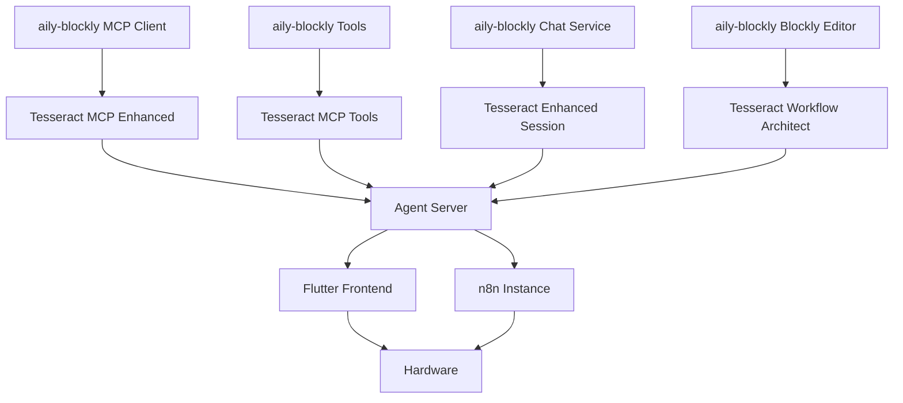

# Tesseract 项目重构执行计划

**文档版本:** v1.0
**创建日期:** 2026-03-03
**目标:** 将 aily-blockly 开源项目的核心能力整合到 Tesseract 生态系统

---

## 执行概要

本文档指导 AI 分阶段将 aily-blockly 项目的关键组件和基础设施适配到 Tesseract 项目，实现硬件版 Cursor 的愿景。

### 核心目标

1. **复用 aily-blockly 的 AI 基础设施**：MCP 客户端、工具系统、对话管理
2. **适配硬件配置流程**：将 Blockly 编程逻辑转换为 n8n 工作流配置
3. **统一用户体验**：前端 Flutter + 后端 Agent + n8n 工作流的无缝集成

---

## 项目架构对比分析

### Tesseract 现有架构

```
用户需求 (Flutter)
    ↓
IntakeAgent (意图解析)
    ↓
ComponentSelector (组件选择)
    ↓
WorkflowArchitect (工作流生成)
    ↓
MCP Validator (校验与自动修复)
    ↓
n8n API (部署)
    ↓
ConfigAgent (引导配置) → Flutter UI
    ↓
硬件下发
```

**关键特点：**
- 后端驱动的 Agent 系统
- n8n 工作流作为中间表示
- 硬件组件配置与工作流节点一一对应

### aily-blockly 架构

```
用户需求 (Angular)
    ↓
Aily Chat (MCP 客户端)
    ↓
AI Tools (文件操作、项目管理、Blockly 编辑)
    ↓
Blockly Workspace (可视化编程)
    ↓
Code Generator (生成 C/C++ 代码)
    ↓
Compiler (编译固件)
    ↓
Uploader (烧录硬件)
```

**关键特点：**
- 前端驱动的 MCP 工具系统
- Blockly 作为可视化编程界面
- 完整的硬件开发工具链（编译、烧录）

---

## 可复用组件清单

### 🔥 高优先级（核心基础设施）

#### 1. MCP 客户端架构
**源文件：** `aily-blockly/src/app/tools/aily-chat/services/mcp.service.ts`

**复用价值：**
- 完整的 MCP 协议实现（stdio + HTTP 模式）
- 工具注册与调用机制
- 资源管理（文件、URL、上下文）

**适配方案：**
- 将 Angular Service 转换为 TypeScript 模块
- 集成到 `backend/src/mcp/` 作为客户端层
- 保留工具注册机制，替换具体工具实现

**目标位置：** `backend/src/mcp/mcp-client-enhanced.ts`

---

#### 2. AI 对话管理系统
**源文件：** `aily-blockly/src/app/tools/aily-chat/services/chat.service.ts`

**复用价值：**
- 流式响应处理
- 上下文管理（历史消息、资源附加）
- 多模型配置（OpenAI、Claude、自定义）

**适配方案：**
- 提取对话状态管理逻辑
- 集成到 `backend/src/agents/session-service.ts`
- 增强现有会话管理能力

**目标位置：** `backend/src/agents/enhanced-session-service.ts`

---

#### 3. 工具系统框架
**源文件：** `aily-blockly/src/app/tools/aily-chat/tools/*.ts`

**复用价值：**
- 文件操作工具（读、写、编辑、删除）
- 项目管理工具（创建、配置、依赖管理）
- 搜索工具（grep、glob、目录树）
- Web 工具（fetch、search）

**适配方案：**
- 保留工具接口定义
- 将文件系统操作适配到服务器环境
- 集成到 MCP 工具集

**目标位置：** `backend/src/mcp/tools/filesystem/`, `backend/src/mcp/tools/project/`

---

#### 4. 安全沙箱机制
**源文件：** `aily-blockly/src/app/tools/aily-chat/services/security.service.ts`

**复用价值：**
- 路径验证（防止目录遍历）
- 命令白名单
- 资源访问控制

**适配方案：**
- 提取安全策略配置
- 集成到 Agent 服务层
- 增强 n8n API 调用安全性

**目标位置：** `backend/src/services/security-service.ts`

---

### 🟡 中优先级（功能增强）

#### 5. Blockly 编辑工具
**源文件：** `aily-blockly/src/app/tools/aily-chat/tools/editBlockTool.ts`

**复用价值：**
- 智能块创建与连接
- 块定义查询
- 工作区概览

**适配方案：**
- 将 Blockly 块操作映射到 n8n 节点操作
- 复用块连接逻辑到工作流连线
- 保留智能分析能力

**目标位置：** `backend/src/agents/workflow-architect/blockly-adapter.ts`

---

#### 6. 项目配置管理
**源文件：** `aily-blockly/src/app/services/project.service.ts`

**复用价值：**
- 项目元数据管理
- 依赖版本控制
- 配置文件解析

**适配方案：**
- 将项目概念映射到工作流会话
- 保留配置持久化机制
- 集成到会话管理

**目标位置：** `backend/src/agents/project-config-service.ts`

---

#### 7. 命令执行框架
**源文件：** `aily-blockly/src/app/services/cmd.service.ts`

**复用价值：**
- 跨平台命令执行
- 进程管理
- 输出流处理

**适配方案：**
- 适配到 Node.js 环境
- 用于硬件通信与调试
- 集成到硬件服务层

**目标位置：** `backend/src/services/hardware-command-service.ts`

---

### 🟢 低优先级（可选增强）

#### 8. UI 组件库
**源文件：** `aily-blockly/src/app/components/`

**复用价值：**
- 对话界面组件
- Mermaid 图表渲染
- 状态查看器

**适配方案：**
- 参考设计模式
- 在 Flutter 前端实现类似组件
- 保持视觉一致性

**目标位置：** `frontend/lib/module/home/widget/`

---

#### 9. 串口调试工具
**源文件：** `aily-blockly/src/app/tools/serial-monitor/`

**复用价值：**
- 串口通信协议
- 数据可视化
- 历史记录管理

**适配方案：**
- 集成到 Flutter 前端
- 用于硬件调试与监控
- 复用数据解析逻辑

**目标位置：** `frontend/lib/module/device/serial_monitor/`

---

## 分阶段执行计划

### 阶段 1：基础设施迁移（2-3 周）

**目标：** 建立 MCP 客户端和工具系统基础

#### 任务 1.1：MCP 客户端迁移
- [ ] 提取 `mcp.service.ts` 核心逻辑
- [ ] 转换为 TypeScript 模块（移除 Angular 依赖）
- [ ] 集成到 `backend/src/mcp/`
- [ ] 编写单元测试
- [ ] 验证与现有 MCP 服务器的兼容性

**输入文件：**
- `aily-blockly/src/app/tools/aily-chat/services/mcp.service.ts`
- `aily-blockly/src/app/tools/aily-chat/mcp/mcp.json`

**输出文件：**
- `backend/src/mcp/mcp-client-enhanced.ts`
- `backend/tests/unit/mcp/mcp-client-enhanced.test.ts`

**验收标准：**
- MCP 客户端可独立运行
- 支持 stdio 和 HTTP 模式
- 通过所有单元测试

---

#### 任务 1.2：工具系统框架迁移
- [ ] 提取文件操作工具
- [ ] 提取搜索工具（grep、glob）
- [ ] 提取项目管理工具
- [ ] 适配到服务器环境
- [ ] 集成到 MCP 工具集

**输入文件：**
- `aily-blockly/src/app/tools/aily-chat/tools/readFileTool.ts`
- `aily-blockly/src/app/tools/aily-chat/tools/editFileTool.ts`
- `aily-blockly/src/app/tools/aily-chat/tools/grepTool.ts`
- `aily-blockly/src/app/tools/aily-chat/tools/globTool.ts`
- `aily-blockly/src/app/tools/aily-chat/tools/getProjectInfoTool.ts`

**输出文件：**
- `backend/src/mcp/tools/filesystem/read-file.ts`
- `backend/src/mcp/tools/filesystem/edit-file.ts`
- `backend/src/mcp/tools/search/grep.ts`
- `backend/src/mcp/tools/search/glob.ts`
- `backend/src/mcp/tools/project/get-info.ts`

**验收标准：**
- 所有工具可通过 MCP 协议调用
- 文件操作安全可靠
- 搜索功能高效准确

---

#### 任务 1.3：安全机制集成
- [ ] 提取安全策略配置
- [ ] 实现路径验证
- [ ] 实现命令白名单
- [ ] 集成到 Agent 服务层

**输入文件：**
- `aily-blockly/src/app/tools/aily-chat/services/security.service.ts`

**输出文件：**
- `backend/src/services/security-service.ts`
- `backend/src/config/security-policies.ts`

**验收标准：**
- 防止目录遍历攻击
- 命令执行受限于白名单
- 通过安全审计测试

---

### 阶段 2：对话管理增强（1-2 周）

**目标：** 提升 Agent 对话能力和上下文管理

#### 任务 2.1：对话服务增强
- [ ] 提取流式响应处理逻辑
- [ ] 增强上下文管理
- [ ] 集成多模型配置
- [ ] 优化历史消息管理

**输入文件：**
- `aily-blockly/src/app/tools/aily-chat/services/chat.service.ts`
- `backend/src/agents/session-service.ts`

**输出文件：**
- `backend/src/agents/enhanced-session-service.ts`
- `backend/src/agents/context-manager.ts`

**验收标准：**
- 支持流式响应
- 上下文窗口管理高效
- 多模型切换无缝

---

#### 任务 2.2：资源管理系统
- [ ] 实现资源附加机制
- [ ] 支持文件、URL、代码片段
- [ ] 集成到对话上下文

**输入文件：**
- `aily-blockly/src/app/tools/aily-chat/aily-chat.component.ts` (ResourceItem 接口)

**输出文件：**
- `backend/src/agents/resource-manager.ts`
- `backend/src/types/resource-types.ts`

**验收标准：**
- 资源可动态附加到对话
- 支持多种资源类型
- 资源引用准确

---

### 阶段 3：工作流适配层（2-3 周）

**目标：** 将 Blockly 编辑逻辑映射到 n8n 工作流操作

#### 任务 3.1：Blockly 到 n8n 映射
- [ ] 分析 Blockly 块结构
- [ ] 定义块到节点的映射规则
- [ ] 实现转换器
- [ ] 验证转换正确性

**输入文件：**
- `aily-blockly/src/app/tools/aily-chat/tools/editBlockTool.ts`
- `backend/src/agents/workflow-architect.ts`

**输出文件：**
- `backend/src/agents/workflow-architect/blockly-adapter.ts`
- `backend/src/agents/workflow-architect/block-to-node-mapping.ts`

**验收标准：**
- Blockly 块可转换为 n8n 节点
- 连接关系正确映射
- 参数配置完整

---

#### 任务 3.2：智能块分析复用
- [ ] 提取块分析逻辑
- [ ] 适配到节点分析
- [ ] 集成到组件选择器

**输入文件：**
- `aily-blockly/src/app/tools/aily-chat/tools/editBlockTool.ts` (analyzeLibraryBlocksTool)
- `backend/src/agents/component-selector.ts`

**输出文件：**
- `backend/src/agents/node-analyzer.ts`

**验收标准：**
- 节点能力自动分析
- 推荐节点准确
- 性能优化

---

### 阶段 4：前端集成（2-3 周）

**目标：** 在 Flutter 前端实现类似 aily-blockly 的交互体验

#### 任务 4.1：对话界面组件
- [ ] 参考 aily-chat 设计
- [ ] 实现 Flutter 对话组件
- [ ] 集成流式响应显示
- [ ] 实现资源附加 UI

**参考文件：**
- `aily-blockly/src/app/tools/aily-chat/aily-chat.component.ts`
- `aily-blockly/src/app/tools/aily-chat/components/`

**输出文件：**
- `frontend/lib/module/home/widget/chat_interface.dart`
- `frontend/lib/module/home/widget/resource_attachment.dart`

**验收标准：**
- 对话界面流畅
- 支持 Markdown 渲染
- 资源附加直观

---

#### 任务 4.2：工作流可视化
- [ ] 集成 n8n iframe
- [ ] 实现工作流预览
- [ ] 同步配置状态

**输出文件：**
- `frontend/lib/module/home/widget/workflow_viewer.dart`

**验收标准：**
- n8n 工作流正确显示
- 配置状态实时同步
- 交互响应快速

---

#### 任务 4.3：硬件调试工具
- [ ] 参考串口监视器设计
- [ ] 实现 Flutter 串口通信
- [ ] 集成数据可视化

**参考文件：**
- `aily-blockly/src/app/tools/serial-monitor/`

**输出文件：**
- `frontend/lib/module/device/serial_monitor/`

**验收标准：**
- 串口通信稳定
- 数据可视化清晰
- 历史记录完整

---

### 阶段 5：端到端集成测试（1-2 周）

**目标：** 验证完整用户历程

#### 任务 5.1：用户历程测试
- [ ] 测试需求描述 → 工作流生成
- [ ] 测试工作流配置 → 硬件下发
- [ ] 测试硬件调试 → 反馈优化

**测试场景：**
1. 情感交互场景（表情识别 + TTS + 屏幕显示）
2. 游戏交互场景（手势识别 + 游戏逻辑 + 反馈）
3. 自定义场景（用户自由组合）

**验收标准：**
- 所有场景端到端通过
- 用户体验流畅
- 错误处理完善

---

#### 任务 5.2：性能优化
- [ ] 优化 Agent 响应时间
- [ ] 优化工作流生成速度
- [ ] 优化前端渲染性能

**验收标准：**
- Agent 响应 < 3 秒
- 工作流生成 < 5 秒
- 前端 FPS > 60

---

### 阶段 6：文档与部署（1 周）

**目标：** 完善文档和部署流程

#### 任务 6.1：技术文档
- [ ] 更新架构文档
- [ ] 编写 API 文档
- [ ] 编写开发指南

**输出文件：**
- `docs/architecture/refactored-system.md`
- `docs/api/enhanced-agent-api.md`
- `docs/development/integration-guide.md`

---

#### 任务 6.2：部署配置
- [ ] 更新 Docker 配置
- [ ] 配置 CI/CD 流程
- [ ] 编写部署文档

**输出文件：**
- `docker/docker-compose.enhanced.yml`
- `.github/workflows/ci-enhanced.yml`
- `docs/deployment/enhanced-deployment.md`

---

## 技术映射表

### Blockly ↔ n8n 映射

| Blockly 概念 | n8n 概念 | 映射规则 |
|-------------|---------|---------|
| Block | Node | 一对一映射 |
| Connection | Connection | 保留连接类型（output → input） |
| Field | Parameter | 字段值映射到节点参数 |
| Variable | Expression | 变量映射到 n8n 表达式 |
| Workspace | Workflow | 工作区映射到工作流 |

### 工具系统映射

| aily-blockly 工具 | Tesseract 对应 | 用途 |
|------------------|---------------|------|
| readFileTool | MCP read_file | 读取配置文件 |
| editFileTool | MCP edit_file | 修改工作流 JSON |
| grepTool | MCP grep | 搜索节点定义 |
| getProjectInfoTool | Session metadata | 获取会话信息 |
| smartBlockTool | ComponentSelector | 智能组件选择 |
| connectBlocksTool | WorkflowArchitect | 工作流连线 |

---

## 风险与缓解策略

### 风险 1：架构不兼容
**描述：** aily-blockly 的前端驱动架构与 Tesseract 的后端驱动架构冲突

**缓解策略：**
- 提取纯逻辑层，移除 UI 依赖
- 使用适配器模式桥接差异
- 保留双向通信能力

---

### 风险 2：性能下降
**描述：** 增加的抽象层导致性能损失

**缓解策略：**
- 使用缓存机制
- 批量操作优化
- 异步处理长时任务

---

### 风险 3：功能冲突
**描述：** 两个系统的功能重叠导致冗余

**缓解策略：**
- 明确功能边界
- 优先使用 Tesseract 现有实现
- 仅复用 aily-blockly 的增强部分

---

## 成功指标

### 技术指标
- [ ] MCP 客户端集成成功率 > 95%
- [ ] 工具系统覆盖率 > 80%
- [ ] 单元测试覆盖率 > 70%
- [ ] 端到端测试通过率 100%

### 性能指标
- [ ] Agent 响应时间 < 3 秒
- [ ] 工作流生成时间 < 5 秒
- [ ] 前端渲染 FPS > 60
- [ ] 内存占用 < 500MB

### 用户体验指标
- [ ] 需求理解准确率 > 90%
- [ ] 工作流生成成功率 > 85%
- [ ] 配置引导完成率 > 80%
- [ ] 用户满意度 > 4.0/5.0

---

## 附录

### A. 关键文件清单

#### aily-blockly 核心文件
```
src/app/tools/aily-chat/
├── services/
│   ├── mcp.service.ts          # MCP 客户端
│   ├── chat.service.ts         # 对话管理
│   └── security.service.ts     # 安全机制
├── tools/
│   ├── readFileTool.ts         # 文件读取
│   ├── editFileTool.ts         # 文件编辑
│   ├── editBlockTool.ts        # Blockly 编辑
│   ├── grepTool.ts             # 搜索工具
│   └── getProjectInfoTool.ts   # 项目信息
└── components/
    ├── dialog/                 # 对话组件
    └── aily-mermaid-viewer/    # 图表渲染
```

#### Tesseract 目标位置
```
backend/src/
├── mcp/
│   ├── mcp-client-enhanced.ts  # 增强 MCP 客户端
│   └── tools/
│       ├── filesystem/         # 文件系统工具
│       ├── search/             # 搜索工具
│       └── project/            # 项目管理工具
├── agents/
│   ├── enhanced-session-service.ts  # 增强会话管理
│   ├── context-manager.ts           # 上下文管理
│   ├── resource-manager.ts          # 资源管理
│   └── workflow-architect/
│       ├── blockly-adapter.ts       # Blockly 适配器
│       └── block-to-node-mapping.ts # 映射规则
└── services/
    ├── security-service.ts     # 安全服务
    └── hardware-command-service.ts  # 硬件命令
```

---

### B. 依赖关系图



---

### C. 开发环境配置

#### 必需工具
- Node.js 18+
- TypeScript 5.6+
- Flutter 3.6+
- Docker (可选)

#### 推荐 IDE
- VS Code + Flutter 插件
- Cursor (AI 辅助开发)
- Claude Code CLI

#### 环境变量
```bash
# backend
AGENT_PORT=3005
N8N_API_URL=http://localhost:5678/api/v1
N8N_PUBLIC_URL=http://localhost:5678
OPENAI_API_KEY=your_key
MCP_MODE=http

# frontend
FLUTTER_WEB_PROXY=ws://localhost:3006/mqtt
```

---

## 维护说明

本文档应在以下情况更新：
1. 完成任何阶段任务后
2. 发现新的可复用组件
3. 架构决策变更
4. 风险或缓解策略调整

**文档所有者：** Tesseract 开发团队
**审核周期：** 每周
**版本控制：** Git + 变更日志
