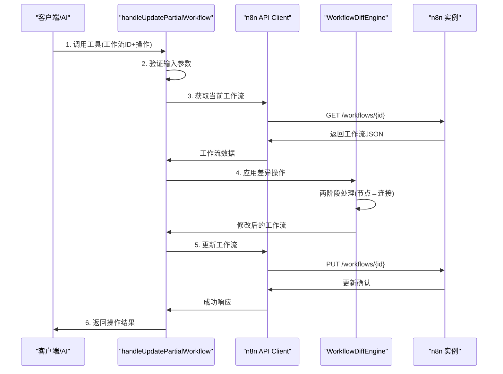

# 从后端修改 n8n 工作流节点字段的全流程

## 流程概览

通过 `n8n_update_partial_workflow` 工具和 `WorkflowDiffEngine` 实现的后端修改流程包含以下主要步骤： [1](#1-0) 



## 详细流程步骤

### 1. 工具调用入口

`n8n_update_partial_workflow` 工具在 `src/mcp/tools-n8n-manager.ts` 中定义 [2](#1-1) ：

```typescript
{
  name: 'n8n_update_partial_workflow',
  description: 'Update workflow incrementally with diff operations...',
  inputSchema: {
    properties: {
      id: { type: 'string', description: 'Workflow ID to update' },
      operations: {
        type: 'array',
        description: 'Array of diff operations to apply'
      },
      validateOnly: { type: 'boolean' },
      continueOnError: { type: 'boolean' }
    },
    required: ['id', 'operations']
  }
}
```

### 2. 请求处理与验证

`handleUpdatePartialWorkflow` 函数接收请求并进行处理 [3](#1-2) ：

```typescript
// 验证输入
const input = workflowDiffSchema.parse(args);

// 获取API客户端
const client = getN8nApiClient(context);
if (!client) {
  return {
    success: false,
    error: 'n8n API not configured. Please set N8N_API_URL and N8N_API_KEY environment variables.'
  };
}
```

### 3. 获取当前工作流状态

通过 n8n API 获取当前工作流的完整状态 [4](#1-3) ：

```typescript
workflow = await client.getWorkflow(input.id);
// 存储原始工作流用于遥测
workflowBefore = JSON.parse(JSON.stringify(workflow));

// 变更前验证（非阻塞）
const validator = getValidator(repository);
validationBefore = await validator.validateWorkflow(workflowBefore, {
  validateNodes: true,
  validateConnections: true,
  validateExpressions: true,
  profile: 'runtime'
});
```

### 4. 工作流备份（可选-暂不实现）

如果启用备份，创建工作流版本 [5](#1-4) ：

```typescript
if (input.createBackup !== false && !input.validateOnly) {
  const versioningService = new WorkflowVersioningService(repository, client);
  const backupResult = await versioningService.createBackup(input.id, workflow, {
    trigger: 'partial_update',
    operations: input.operations
  });
}
```

### 5. 差异引擎应用操作

创建 `WorkflowDiffEngine` 实例并应用差异操作 [6](#1-5) ：

```typescript
const diffEngine = new WorkflowDiffEngine();
const diffRequest = input as WorkflowDiffRequest;
const diffResult = await diffEngine.applyDiff(workflow, diffRequest);
```

#### 5.1 两阶段处理机制

`WorkflowDiffEngine.applyDiff()` 实现两阶段处理 [7](#1-6) ：

```typescript
// 按类型分组操作
const nodeOperationTypes = ['addNode', 'removeNode', 'updateNode', 'moveNode', 'enableNode', 'disableNode'];
const nodeOperations = [];
const otherOperations = [];

request.operations.forEach((operation, index) => {
  if (nodeOperationTypes.includes(operation.type)) {
    nodeOperations.push({ operation, index });
  } else {
    otherOperations.push({ operation, index });
  }
});

const allOperations = [...nodeOperations, ...otherOperations];
```

#### 5.2 updateNode 操作的具体实现

对于修改节点字段，使用 `setNestedProperty` 方法支持点记法 [8](#1-7) ：

```typescript
private setNestedProperty(obj: any, path: string, value: any): void {
  const keys = path.split('.');
  let current = obj;
  
  for (let i = 0; i < keys.length - 1; i++) {
    const key = keys[i];
    if (!(key in current) || typeof current[key] !== 'object') {
      current[key] = {};
    }
    current = current[key];
  }
  
  const finalKey = keys[keys.length - 1];
  if (value === undefined) {
    delete current[finalKey];
  } else {
    current[finalKey] = value;
  }
}
```

### 6. 结果验证与更新

检查差异应用结果并决定是否更新 [9](#1-8) ：

```typescript
if (!diffResult.success) {
  return {
    success: false,
    error: 'Failed to apply diff operations',
    details: {
      errors: diffResult.errors,
      operationsApplied: diffResult.operationsApplied,
      applied: diffResult.applied,
      failed: diffResult.failed
    }
  };
}
```

### 7. 通过 n8n API 更新工作流

将修改后的工作流提交到 n8n 实例 [10](#1-9) ：

```typescript
const updatedWorkflow = await client.updateWorkflow(input.id, diffResult.workflow!);
```

### 8. 工作流激活/停用处理

根据需要激活或停用工作流 [11](#1-10) ：

```typescript
if (diffResult.shouldActivate) {
  finalWorkflow = await client.activateWorkflow(input.id);
  activationMessage = ' Workflow activated.';
} else if (diffResult.shouldDeactivate) {
  finalWorkflow = await client.deactivateWorkflow(input.id);
  activationMessage = ' Workflow deactivated.';
}
```

### 9. 返回操作结果

构建并返回详细的操作结果 [12](#1-11) ：

```typescript
return {
  success: true,
  data: {
    id: finalWorkflow.id,
    name: finalWorkflow.name,
    active: finalWorkflow.active,
    nodeCount: finalWorkflow.nodes?.length || 0,
    operationsApplied: diffResult.operationsApplied
  },
  message: `Workflow "${finalWorkflow.name}" updated successfully. Applied ${diffResult.operationsApplied} operations.${activationMessage}`,
  details: {
    applied: diffResult.applied,
    failed: diffResult.failed,
    errors: diffResult.errors,
    warnings: diffResult.warnings
  }
};
```

## 关键技术特性

### 原子性保证

默认情况下，所有操作要么全部成功，要么全部失败 [13](#1-12) 。

### 错误处理模式

支持 `continueOnError` 模式，允许部分操作失败时继续执行 [14](#1-13) 。

### 验证模式

支持 `validateOnly` 模式，仅验证操作而不实际应用 [15](#1-14) 。

## Notes

- 整个流程通过 n8n REST API 与前端实例交互，确保修改实时反映
- 支持点记法修改深层嵌套字段，如 `parameters.headers.Authorization`
- 包含完整的验证、备份、错误处理和遥测机制
- 相比完整工作流更新，可减少 80-90% 的网络传输和令牌使用量

Wiki pages you might want to explore:
- [Workflow Management Tools (czlonkowski/n8n-mcp)](/wiki/czlonkowski/n8n-mcp#4.4)
- [Workflow Diff Engine (czlonkowski/n8n-mcp)](/wiki/czlonkowski/n8n-mcp#5.6)

### Citations

**File:** src/mcp/handlers-workflow-diff.ts (L73-213)
```typescript
export async function handleUpdatePartialWorkflow(
  args: unknown,
  repository: NodeRepository,
  context?: InstanceContext
): Promise<McpToolResponse> {
  const startTime = Date.now();
  const sessionId = `mutation_${Date.now()}_${Math.random().toString(36).slice(2, 11)}`;
  let workflowBefore: any = null;
  let validationBefore: any = null;
  let validationAfter: any = null;

  try {
    // Debug logging (only in debug mode)
    if (process.env.DEBUG_MCP === 'true') {
      logger.debug('Workflow diff request received', {
        argsType: typeof args,
        hasWorkflowId: args && typeof args === 'object' && 'workflowId' in args,
        operationCount: args && typeof args === 'object' && 'operations' in args ?
          (args as any).operations?.length : 0
      });
    }

    // Validate input
    const input = workflowDiffSchema.parse(args);

    // Get API client
    const client = getN8nApiClient(context);
    if (!client) {
      return {
        success: false,
        error: 'n8n API not configured. Please set N8N_API_URL and N8N_API_KEY environment variables.'
      };
    }

    // Fetch current workflow
    let workflow;
    try {
      workflow = await client.getWorkflow(input.id);
      // Store original workflow for telemetry
      workflowBefore = JSON.parse(JSON.stringify(workflow));

      // Validate workflow BEFORE mutation (for telemetry)
      try {
        const validator = getValidator(repository);
        validationBefore = await validator.validateWorkflow(workflowBefore, {
          validateNodes: true,
          validateConnections: true,
          validateExpressions: true,
          profile: 'runtime'
        });
      } catch (validationError) {
        logger.debug('Pre-mutation validation failed (non-blocking):', validationError);
        // Don't block mutation on validation errors
        validationBefore = {
          valid: false,
          errors: [{ type: 'validation_error', message: 'Validation failed' }]
        };
      }
    } catch (error) {
      if (error instanceof N8nApiError) {
        return {
          success: false,
          error: getUserFriendlyErrorMessage(error),
          code: error.code
        };
      }
      throw error;
    }

    // Create backup before modifying workflow (default: true)
    if (input.createBackup !== false && !input.validateOnly) {
      try {
        const versioningService = new WorkflowVersioningService(repository, client);
        const backupResult = await versioningService.createBackup(input.id, workflow, {
          trigger: 'partial_update',
          operations: input.operations
        });

        logger.info('Workflow backup created', {
          workflowId: input.id,
          versionId: backupResult.versionId,
          versionNumber: backupResult.versionNumber,
          pruned: backupResult.pruned
        });
      } catch (error: any) {
        logger.warn('Failed to create workflow backup', {
          workflowId: input.id,
          error: error.message
        });
        // Continue with update even if backup fails (non-blocking)
      }
    }

    // Apply diff operations
    const diffEngine = new WorkflowDiffEngine();
    const diffRequest = input as WorkflowDiffRequest;
    const diffResult = await diffEngine.applyDiff(workflow, diffRequest);

    // Check if this is a complete failure or partial success in continueOnError mode
    if (!diffResult.success) {
      // In continueOnError mode, partial success is still valuable
      if (diffRequest.continueOnError && diffResult.workflow && diffResult.operationsApplied && diffResult.operationsApplied > 0) {
        logger.info(`continueOnError mode: Applying ${diffResult.operationsApplied} successful operations despite ${diffResult.failed?.length || 0} failures`);
        // Continue to update workflow with partial changes
      } else {
        // Complete failure - return error
        return {
          success: false,
          error: 'Failed to apply diff operations',
          details: {
            errors: diffResult.errors,
            warnings: diffResult.warnings,
            operationsApplied: diffResult.operationsApplied,
            applied: diffResult.applied,
            failed: diffResult.failed
          }
        };
      }
    }
    
    // If validateOnly, return validation result
    if (input.validateOnly) {
      return {
        success: true,
        message: diffResult.message,
        data: {
          valid: true,
          operationsToApply: input.operations.length
        },
        details: {
          warnings: diffResult.warnings
        }
      };
    }

    // Validate final workflow structure after applying all operations
    // This prevents creating workflows that pass operation-level validation
    // but fail workflow-level validation (e.g., UI can't render them)
    //
    // Validation can be skipped for specific integration tests that need to test
    // n8n API behavior with edge case workflows by setting SKIP_WORKFLOW_VALIDATION=true
```

**File:** src/mcp/handlers-workflow-diff.ts (L288-291)
```typescript
    // Update workflow via API
    try {
      const updatedWorkflow = await client.updateWorkflow(input.id, diffResult.workflow!);

```

**File:** src/mcp/handlers-workflow-diff.ts (L314-344)
```typescript
      if (diffResult.shouldActivate) {
        try {
          finalWorkflow = await client.activateWorkflow(input.id);
          activationMessage = ' Workflow activated.';
        } catch (activationError) {
          logger.error('Failed to activate workflow after update', activationError);
          return {
            success: false,
            error: 'Workflow updated successfully but activation failed',
            details: {
              workflowUpdated: true,
              activationError: activationError instanceof Error ? activationError.message : 'Unknown error'
            }
          };
        }
      } else if (diffResult.shouldDeactivate) {
        try {
          finalWorkflow = await client.deactivateWorkflow(input.id);
          activationMessage = ' Workflow deactivated.';
        } catch (deactivationError) {
          logger.error('Failed to deactivate workflow after update', deactivationError);
          return {
            success: false,
            error: 'Workflow updated successfully but deactivation failed',
            details: {
              workflowUpdated: true,
              deactivationError: deactivationError instanceof Error ? deactivationError.message : 'Unknown error'
            }
          };
        }
      }
```

**File:** src/mcp/handlers-workflow-diff.ts (L364-380)
```typescript
      return {
        success: true,
        data: {
          id: finalWorkflow.id,
          name: finalWorkflow.name,
          active: finalWorkflow.active,
          nodeCount: finalWorkflow.nodes?.length || 0,
          operationsApplied: diffResult.operationsApplied
        },
        message: `Workflow "${finalWorkflow.name}" updated successfully. Applied ${diffResult.operationsApplied} operations.${activationMessage} Use n8n_get_workflow with mode 'structure' to verify current state.`,
        details: {
          applied: diffResult.applied,
          failed: diffResult.failed,
          errors: diffResult.errors,
          warnings: diffResult.warnings
        }
      };
```

**File:** src/mcp/tools-n8n-manager.ts (L145-181)
```typescript
    name: 'n8n_update_partial_workflow',
    description: `Update workflow incrementally with diff operations. Types: addNode, removeNode, updateNode, moveNode, enable/disableNode, addConnection, removeConnection, updateSettings, updateName, add/removeTag. See tools_documentation("n8n_update_partial_workflow", "full") for details.`,
    inputSchema: {
      type: 'object',
      additionalProperties: true,  // Allow any extra properties Claude Desktop might add
      properties: {
        id: { 
          type: 'string', 
          description: 'Workflow ID to update' 
        },
        operations: {
          type: 'array',
          description: 'Array of diff operations to apply. Each operation must have a "type" field and relevant properties for that operation type.',
          items: {
            type: 'object',
            additionalProperties: true
          }
        },
        validateOnly: {
          type: 'boolean',
          description: 'If true, only validate operations without applying them'
        },
        continueOnError: {
          type: 'boolean',
          description: 'If true, apply valid operations even if some fail (best-effort mode). Returns applied and failed operation indices. Default: false (atomic)'
        }
      },
      required: ['id', 'operations']
    },
    annotations: {
      title: 'Update Partial Workflow',
      readOnlyHint: false,
      destructiveHint: false,
      idempotentHint: true,
      openWorldHint: true,
    },
  },
```

**File:** src/services/workflow-diff-engine.ts (L62-75)
```typescript
      // Group operations by type for two-pass processing
      const nodeOperationTypes = ['addNode', 'removeNode', 'updateNode', 'moveNode', 'enableNode', 'disableNode'];
      const nodeOperations: Array<{ operation: WorkflowDiffOperation; index: number }> = [];
      const otherOperations: Array<{ operation: WorkflowDiffOperation; index: number }> = [];

      request.operations.forEach((operation, index) => {
        if (nodeOperationTypes.includes(operation.type)) {
          nodeOperations.push({ operation, index });
        } else {
          otherOperations.push({ operation, index });
        }
      });

      const allOperations = [...nodeOperations, ...otherOperations];
```

**File:** src/services/workflow-diff-engine.ts (L81-107)
```typescript
      if (request.continueOnError) {
        // Best-effort mode: continue even if some operations fail
        for (const { operation, index } of allOperations) {
          const error = this.validateOperation(workflowCopy, operation);
          if (error) {
            errors.push({
              operation: index,
              message: error,
              details: operation
            });
            failedIndices.push(index);
            continue;
          }

          try {
            this.applyOperation(workflowCopy, operation);
            appliedIndices.push(index);
          } catch (error) {
            const errorMsg = `Failed to apply operation: ${error instanceof Error ? error.message : 'Unknown error'}`;
            errors.push({
              operation: index,
              message: errorMsg,
              details: operation
            });
            failedIndices.push(index);
          }
        }
```

**File:** src/services/workflow-diff-engine.ts (L119-192)
```typescript
            message: errors.length === 0
              ? 'Validation successful. All operations are valid.'
              : `Validation completed with ${errors.length} errors.`,
            errors: errors.length > 0 ? errors : undefined,
            warnings: this.warnings.length > 0 ? this.warnings : undefined,
            applied: appliedIndices,
            failed: failedIndices
          };
        }

        const success = appliedIndices.length > 0;
        return {
          success,
          workflow: workflowCopy,
          operationsApplied: appliedIndices.length,
          message: `Applied ${appliedIndices.length} operations, ${failedIndices.length} failed (continueOnError mode)`,
          errors: errors.length > 0 ? errors : undefined,
          warnings: this.warnings.length > 0 ? this.warnings : undefined,
          applied: appliedIndices,
          failed: failedIndices
        };
      } else {
        // Atomic mode: all operations must succeed
        // Pass 1: Validate and apply node operations first
        for (const { operation, index } of nodeOperations) {
          const error = this.validateOperation(workflowCopy, operation);
          if (error) {
            return {
              success: false,
              errors: [{
                operation: index,
                message: error,
                details: operation
              }]
            };
          }

          try {
            this.applyOperation(workflowCopy, operation);
          } catch (error) {
            return {
              success: false,
              errors: [{
                operation: index,
                message: `Failed to apply operation: ${error instanceof Error ? error.message : 'Unknown error'}`,
                details: operation
              }]
            };
          }
        }

        // Update connection references after all node renames
        if (this.renameMap.size > 0) {
          this.updateConnectionReferences(workflowCopy);
          logger.debug(`Auto-updated ${this.renameMap.size} node name references in connections`);
        }

        // Pass 2: Validate and apply other operations (connections, metadata)
        for (const { operation, index } of otherOperations) {
          const error = this.validateOperation(workflowCopy, operation);
          if (error) {
            return {
              success: false,
              errors: [{
                operation: index,
                message: error,
                details: operation
              }]
            };
          }

          try {
            this.applyOperation(workflowCopy, operation);
          } catch (error) {
```

**File:** src/services/workflow-diff-engine.ts (L903-934)
```typescript
    );

    if (activatableTriggers.length === 0) {
      return 'Cannot activate workflow: No activatable trigger nodes found. Workflows must have at least one enabled trigger node (webhook, schedule, executeWorkflowTrigger, etc.).';
    }

    return null;
  }

  private validateDeactivateWorkflow(workflow: Workflow, operation: DeactivateWorkflowOperation): string | null {
    // Deactivation is always valid - any workflow can be deactivated
    return null;
  }

  // Workflow activation operation appliers
  private applyActivateWorkflow(workflow: Workflow, operation: ActivateWorkflowOperation): void {
    // Set flag in workflow object to indicate activation intent
    // The handler will call the API method after workflow update
    (workflow as any)._shouldActivate = true;
  }

  private applyDeactivateWorkflow(workflow: Workflow, operation: DeactivateWorkflowOperation): void {
    // Set flag in workflow object to indicate deactivation intent
    // The handler will call the API method after workflow update
    (workflow as any)._shouldDeactivate = true;
  }

  // Connection cleanup operation validators
  private validateCleanStaleConnections(workflow: Workflow, operation: CleanStaleConnectionsOperation): string | null {
    // This operation is always valid - it just cleans up what it finds
    return null;
  }
```
